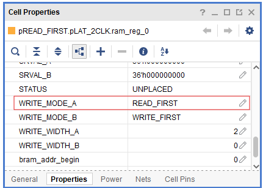
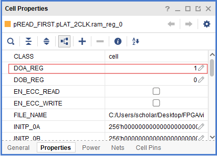

# BRAM USAGE — Single-Port Block RAM

This module implements a **single-port synchronous RAM** (Block RAM inference) in VHDL.
It supports **READ\_FIRST** and **WRITE\_FIRST** modes and configurable read latency (**1-CLK** or **2-CLK**).

> **Note:** Generic string values are **case-sensitive**. Use exactly `"READ_FIRST"` / `"WRITE_FIRST"` and `"1_CLK"` / `"2_CLK"`.

## 🔧 Generics

| Name        | Type    | Default        | Description                                      |
| ----------- | ------- | -------------- | ------------------------------------------------ |
| `WIDTH`     | integer | `8`            | Data bus width (bits per word)                   |
| `ADDR_BITS` | integer | `14`           | Address width. **Depth = 2^ADDR\_BITS**          |
| `read_type` | string  | `"READ_FIRST"` | Read behavior: `"READ_FIRST"` or `"WRITE_FIRST"` |
| `LAT`       | string  | `"2_CLK"`      | Read latency: `"1_CLK"` or `"2_CLK"`             |

## ⏱️ Read Latency

### 1-CLK mode

`dout_o` updates **one clock** after address changes.

```
clk:   ┌─┐   ┌─┐   ┌─┐
addr:  AAAAA BBBBB CCCCC
dout:  ----- AAA   BBB
```

### 2-CLK mode

Additional output register → **two clocks** of latency. Helps timing closure.

```
clk:   ┌─┐   ┌─┐   ┌─┐   ┌─┐
addr:  AAAAA BBBBB CCCCC
dout:  ----- ----- AAA   BBB
```

## ⚙️ Read/Write Modes

* **READ\_FIRST**
  On a write to the addressed location, `dout_o` shows the **previous (old) RAM data** in that cycle. Next cycle shows the updated data.

* **WRITE\_FIRST**
  On a write, `dout_o` immediately reflects the **new write data** in that cycle.

*(A “NO\_CHANGE” variant can be added later using the same generate structure.)*

## 📜 VHDL Source (single file)

```vhdl
library IEEE;
use IEEE.STD_LOGIC_1164.ALL;
use IEEE.NUMERIC_STD.ALL;

entity spbram is
  generic (
    WIDTH      : integer := 8;
    ADDR_BITS  : integer := 14;              -- Depth = 2**ADDR_BITS
    read_type  : string  := "READ_FIRST";    -- "READ_FIRST" | "WRITE_FIRST" (case-sensitive)
    LAT        : string  := "2_CLK"          -- "1_CLK" | "2_CLK" (case-sensitive)
  );
  port (
    clk    : in  std_logic;
    we_i   : in  std_logic;
    addr_i : in  std_logic_vector(ADDR_BITS-1 downto 0);
    din_i  : in  std_logic_vector(WIDTH-1 downto 0);
    dout_o : out std_logic_vector(WIDTH-1 downto 0)
  );
end spbram;

architecture Behavioral of spbram is
  -- Inference as Block RAM hint (Vivado)
  type t_ram is array (0 to 2**ADDR_BITS - 1) of std_logic_vector(WIDTH-1 downto 0);
  signal ram : t_ram := (others => (others => '0'));
  
  attribute ram_style : string;
  attribute ram_style of ram : signal is "block";

  signal ram_int : std_logic_vector(WIDTH-1 downto 0) := (others => '0');
begin
  ------------------------------------------------------------------------------
  -- READ_FIRST
  ------------------------------------------------------------------------------
  G_READ_FIRST : if read_type = "READ_FIRST" generate

    -- 1-CLK latency
    G_LAT_1 : if LAT = "1_CLK" generate
      process (clk)
      begin
        if rising_edge(clk) then
          if we_i = '1' then
            ram(to_integer(unsigned(addr_i))) <= din_i;  -- write
          end if;
          dout_o <= ram(to_integer(unsigned(addr_i)));    -- old data in write cycle
        end if;
      end process;
    end generate G_LAT_1;

    -- 2-CLK latency
    G_LAT_2 : if LAT = "2_CLK" generate
      process (clk)
      begin
        if rising_edge(clk) then
          if we_i = '1' then
            ram(to_integer(unsigned(addr_i))) <= din_i;   -- write
          end if;
          ram_int <= ram(to_integer(unsigned(addr_i)));   -- stage 1
          dout_o  <= ram_int;                             -- stage 2
        end if;
      end process;
    end generate G_LAT_2;

  end generate G_READ_FIRST;

  ------------------------------------------------------------------------------
  -- WRITE_FIRST
  ------------------------------------------------------------------------------
  G_WRITE_FIRST : if read_type = "WRITE_FIRST" generate

    -- 1-CLK latency
    G_LAT_1 : if LAT = "1_CLK" generate
      process (clk)
      begin
        if rising_edge(clk) then
          -- default: read RAM
          dout_o <= ram(to_integer(unsigned(addr_i)));
          if we_i = '1' then
            ram(to_integer(unsigned(addr_i))) <= din_i;   -- write
            dout_o <= din_i;                              -- immediate new data
          end if;
        end if;
      end process;
    end generate G_LAT_1;

    -- 2-CLK latency
    G_LAT_2 : if LAT = "2_CLK" generate
      process (clk)
      begin
        if rising_edge(clk) then
          ram_int <= ram(to_integer(unsigned(addr_i)));   -- stage 1
          dout_o  <= ram_int;                             -- stage 2

          if we_i = '1' then
            ram(to_integer(unsigned(addr_i))) <= din_i;   -- write
            -- For true WRITE_FIRST behavior with 2-CLK pipeline, drive dout directly:
            dout_o <= din_i;                              -- immediate new data (bypasses pipeline)
          end if;
        end if;
      end process;
    end generate G_LAT_2;

  end generate G_WRITE_FIRST;

end Behavioral;
```

## 🧪 Minimal Usage

```vhdl
u_bram : entity work.spbram
  generic map (
    WIDTH      => 16,
    ADDR_BITS  => 10,
    read_type  => "WRITE_FIRST",
    LAT        => "1_CLK"
  )
  port map (
    clk    => clk,
    we_i   => we,
    addr_i => addr,
    din_i  => din,
    dout_o => dout
  );
```

## 🖼️ Vivado Synthesis Notes

Since we set `read_type = "READ_FIRST"`, after synthesis you should see the BRAM property indicating **READ\_FIRST** mode:



And because `LAT = "2_CLK"`, Vivado will register the output once (`DOA_REG = 1`); with 1-CLK it would be `0`:



> Some small memories may infer LUTRAM if the tool thinks it’s cheaper. The `ram_style = "block"` attribute above nudges Vivado to use BRAM.

## References

* [VHDL ile FPGA PROGRAMLAMA](https://www.udemy.com/course/vhdl-ile-fpga-programlama-temel-seviye/)
