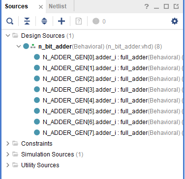
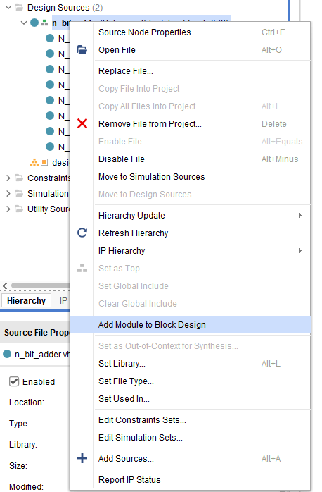
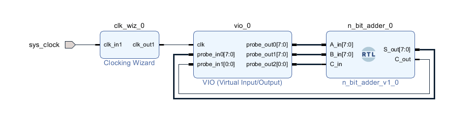
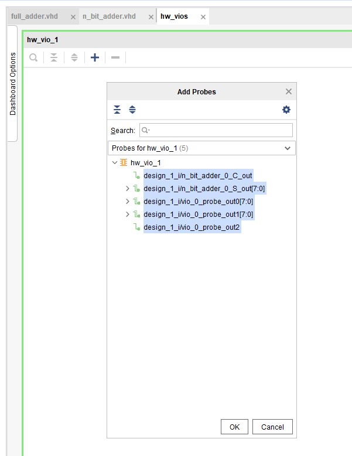
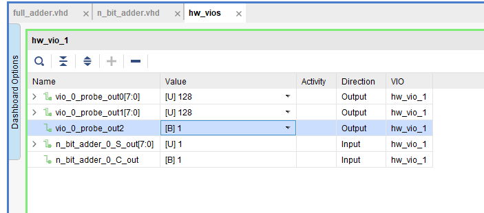

# N-Bit Adder with VIO & ILA (CMOD A7)

This small project demonstrates how to build an **N-bit adder** using the `generate` construct in VHDL and how to drive/observe it with **VIO (Virtual I/O)** and **ILA (Integrated Logic Analyzer)** IPs in Vivado.

Since the **CMOD A7** board has no physical switches or LEDs, VIO is used to provide inputs and observe outputs in real time. ILA can be optionally added to monitor internal signals.


## 1) Full Adder and N-Bit Adder

A **full adder** sums three inputs (`A`, `B`, `Cin`) and produces a **Sum (S)** and **Carry-out (Cout)**.

Formulas:

* `S = A ⊕ B ⊕ Cin`
* `Cout = (A·B) + (B·Cin) + (A·Cin)`

```vhdl
library IEEE;
use IEEE.STD_LOGIC_1164.ALL;

entity full_adder is
port(
    a,b,cin: in  std_logic;
    s,cout:  out std_logic
);
end full_adder;

architecture Behavioral of full_adder is
begin
    s    <= a xor b xor cin;
    cout <= (a and b) or (b and cin) or (a and cin);
end Behavioral;
```

The **N-bit adder** is created by chaining full adders in a generate loop. `carry(0)` is tied to the external `C_in`, and the final `carry(N)` becomes the `C_out`.

In the sources, you’ll see N instances (`adder_i`) generated:



```vhdl
library IEEE;
use IEEE.STD_LOGIC_1164.ALL;

entity n_bit_adder is 
generic(
    N : integer := 8
);
port(
    A_in  : in  std_logic_vector(N-1 downto 0);
    B_in  : in  std_logic_vector(N-1 downto 0);
    C_in  : in  std_logic;
    S_out : out std_logic_vector(N-1 downto 0);
    C_out : out std_logic
);
end n_bit_adder;

architecture Behavioral of n_bit_adder is
    signal carry : std_logic_vector(N downto 0) := (others => '0');
begin
    N_ADDER_GEN: for i in 0 to N-1 generate
        adder_i : entity work.full_adder 
        port map(
            a    => A_in(i),
            b    => B_in(i),
            cin  => carry(i),
            s    => S_out(i),
            cout => carry(i+1)
        );
    end generate;

    carry(0) <= C_in;
    C_out    <= carry(N);
end Behavioral;
```

> **Note:** The example assumes `i=0` is the LSB. If you prefer MSB-first indexing, adjust the mapping accordingly.


## 2) Using VIO in Block Design

Because CMOD A7 has no external switches/LEDs, **VIO** is used to drive and observe the adder.

1. Create a **Block Design**.
2. Add the `n_bit_adder` VHDL module:
   
3. Add a **VIO** IP and connect ports:
   

   * `A_in`, `B_in`, `C_in` → **VIO outputs**
   * `S_out`, `C_out` → **VIO inputs**
4. Right-click the design → **Create HDL Wrapper** → *Let Vivado manage updates…*
5. Set wrapper as **Top**.
6. Generate bitstream and program the device.

After programming, open the **VIO window**, click the `+` sign, and select the signals. You can now drive inputs (`A_in`, `B_in`, `C_in`) and observe outputs (`S_out`, `C_out`) live:





## 3) Optional: Monitoring with ILA

For deeper debugging, add an **ILA** to probe signals. Suggested probes:

* `A_in`, `B_in`, `S_out`, `C_out`
* Internal `carry` chain

With triggers set on conditions (e.g., `C_out = '1'`), you can capture events like overflow and see how carries propagate bit by bit.

