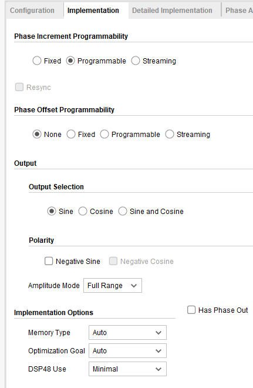

# Sine Wave Generation using Xilinx DDS Compiler

This project demonstrates generating sine waves on FPGA using the **Xilinx DDS Compiler IP**. The goal is to document the configuration choices, frequency resolution, and supporting RTL logic used in the design.

---

## Frequency Resolution

The DDS output frequency is controlled by the **Frequency Tuning Word (FTW)**.

$$
f_\text{out} = \frac{FTW}{2^N} \cdot f_\text{clk}
$$

With:

* System clock: $$f_\text{clk} = 100\ \text{MHz}$$
* Phase width: $$N = 32\ \text{bits}$$

We obtain:

* $$2^{32} = 4,294,967,296$$
* **FTW per Hz**:
  $$
  \frac{2^{32}}{f_\text{clk}} = \frac{4,294,967,296}{100,000,000} \approx 42.95
  $$
* **Frequency resolution (Hz per FTW)**:
  $$
  \frac{f_\text{clk}}{2^{32}} \approx 0.0233\ \text{Hz}
  $$

This means every increment of the FTW corresponds to ~23 mHz at a 100 MHz clock.

---

## DDS Compiler Configuration

Key configuration parameters:

* **Phase Width**: 32 bits
* **Output Width**: 16 bits
* **Phase Increment**: *Programmable* (allows dynamic frequency updates)
* **Output Selection**: Sine only
* **Phase Output**: Disabled


*DDS Compiler configuration menu.*


*DDS Compiler implementation options.*

---

## Block Design

The DDS Compiler is instantiated alongside a simple RTL module that generates a one-shot pulse. This pulse updates the FTW exactly once after reset, ensuring clean frequency initialization.


*Vivado block design integrating DDS Compiler and control logic.*

---

## One-Pulse Generator RTL

The `one_pulse_after_n` RTL module generates a single output pulse after **N clock cycles**. This pulse can optionally be stretched to `PULSE_LEN` cycles. It is used here to trigger the FTW update to the DDS Compiler.

```vhdl
library IEEE;
use IEEE.STD_LOGIC_1164.ALL;

entity one_pulse_after_n is
  generic(
    N         : integer := 10;  -- wait N clocks
    PULSE_LEN : integer := 1    -- pulse length in clocks
  );
  port(
    clk   : in  std_logic; 
    rst   : in  std_logic;  -- synchronous reset, active high
    pulse : out std_logic
  );
end entity;

architecture rtl of one_pulse_after_n is
  signal cnt  : integer range 0 to N+PULSE_LEN := 0;
  signal done : std_logic := '0';
begin
  process(clk)
  begin
    if rising_edge(clk) then
      if rst = '1' then
        cnt  <= 0;
        done <= '0';
      else
        if done = '0' then
          cnt <= cnt + 1;
          if cnt = N+PULSE_LEN then
            done <= '1';
          end if;
        end if;
      end if;
    end if;
  end process;

  pulse <= '1' when (done='0') and (cnt > N) and (cnt <= N+PULSE_LEN) else '0';
end architecture;
```

---

## Simulation Results

A simulation testbench confirms correct sine wave generation. With an FTW value of **42,949,672**, the output frequency matches the expected calculation.


*Simulation waveform: sine output with valid FTW update.*

---

## How to Calculate FTW for a Target Frequency

To generate a desired output frequency $$f_\text{out}$$, compute the FTW as:

$$
FTW = \frac{f_\text{out}}{f_\text{clk}} \cdot 2^N
$$

### Example 1: 1 kHz output

$$
FTW = \frac{1000}{100 \times 10^6} \cdot 2^{32}
\approx 42{,}950
$$

### Example 2: 10 kHz output

$$
FTW = \frac{10{,}000}{100 \times 10^6} \cdot 2^{32}
\approx 429{,}497
$$

### Example 3: 1 MHz output

$$
FTW = \frac{1{,}000{,}000}{100 \times 10^6} \cdot 2^{32}
\approx 42{,}949{,}672
$$

---

## Quick Reference Table (100 MHz clock, 32-bit phase accumulator)

| Output Frequency | FTW Value     |
| ---------------- | ------------- |
| 1 Hz             | 42.95         |
| 10 Hz            | 429.5         |
| 100 Hz           | 4,295         |
| 1 kHz            | 42,950        |
| 10 kHz           | 429,497       |
| 100 kHz          | 4,294,967     |
| 1 MHz            | 42,949,672    |
| 10 MHz           | 429,496,729   |
| 25 MHz           | 1,073,741,824 |
| 50 MHz (Nyquist) | 2,147,483,648 |

*Note: FTW values are rounded to the nearest integer.*

---

## Summary

* A 32-bit DDS accumulator running at 100 MHz yields a frequency resolution of ~0.023 Hz.
* The FTW controls output frequency directly, with ~42.95 FTW units per Hz.
* A simple pulse generator ensures a single clean configuration update after reset.
* The design is fully parameterized and can be extended for programmable sweeps or dynamic frequency control.
* The quick reference table makes it easy to choose FTW values for common target frequencies.

