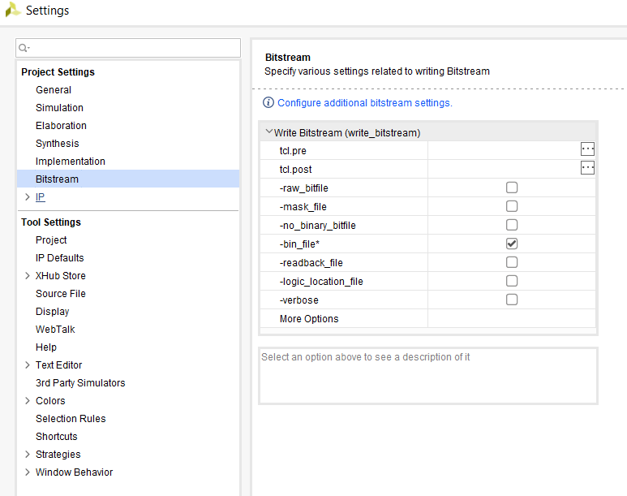
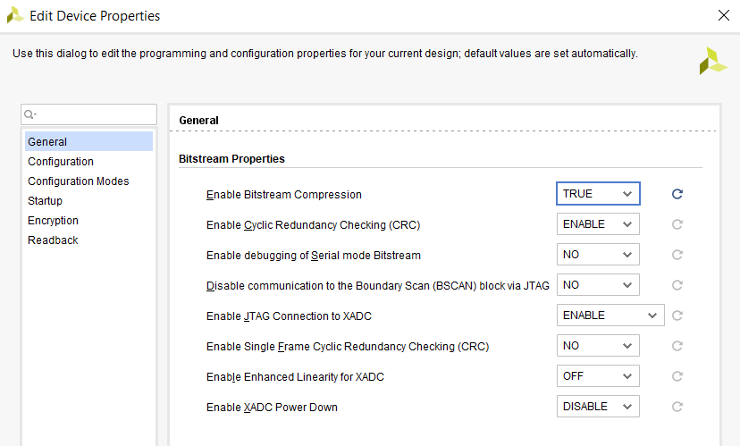
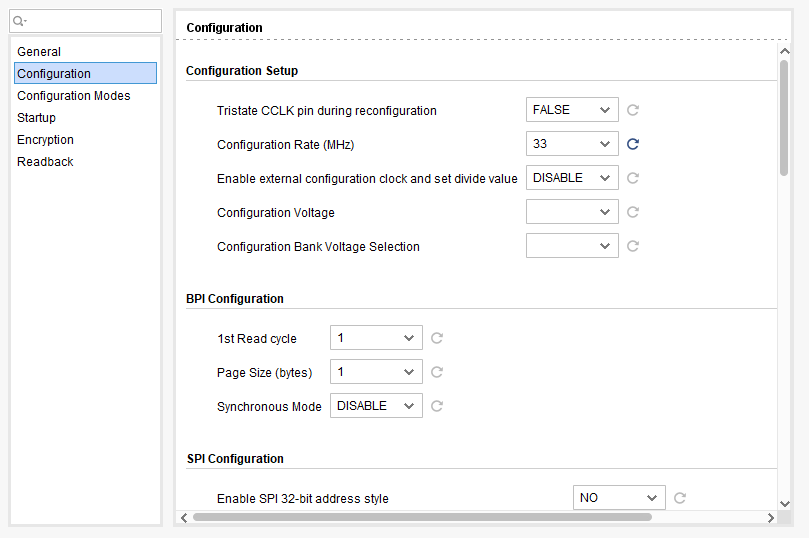
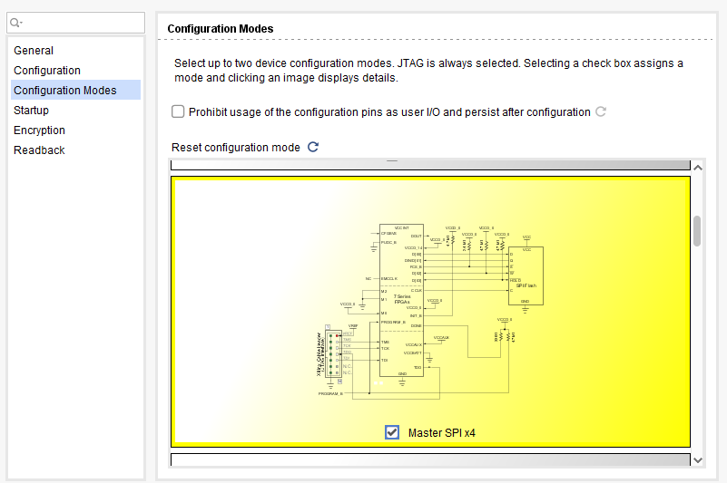

# Programming FPGA with Quad SPI Flash

To make your FPGA design permanent (i.e., stored in flash), you need to generate a `.bin` file and program the onboard QSPI memory.

---

## Step 1: Enable `.bin` File Generation

Go to **Tools → Settings → Bitstream**, and enable the `-bin_file` option.

Re-run **Synthesis** so the new options are available.

---

## Step 2: Optimize Bitstream for Flash Programming

Open **Tools → Edit Device Properties** and adjust the following settings:

* `General → Enable Bitstream Compression → TRUE`
  

* `Configuration → Configuration Rate → 33 MHz`
  

* `Configuration Modes → Master SPI x4`
  

These settings speed up configuration from flash.

---

## Step 3: Program QSPI Flash

After **Generate Bitstream**, both `.bit` and `.bin` files will be created.

1. Open Hardware Manager (**Open Hardware Device → Open Target**).
2. Right-click on the FPGA and select **Add Configuration Memory Device**.
3. Choose the correct flash chip.

   * For **Cmod A7 Rev. C**, the device is `Macronix MX25L3233FZBI-08Q`.
4. Select the `.bin` file (e.g., `project.runs/impl_1/project.bin`) as the configuration file.
5. Program the device.

Once complete, the design will automatically load from flash on power-up.

---

## References

1. [Cmod A7 Programming Guide](https://digilent.com/reference/learn/programmable-logic/tutorials/cmod-a7-programming-guide/start)
2. [Cmod A7 GPIO Demo](https://digilent.com/reference/programmable-logic/cmod-a7/demos/gpio)
